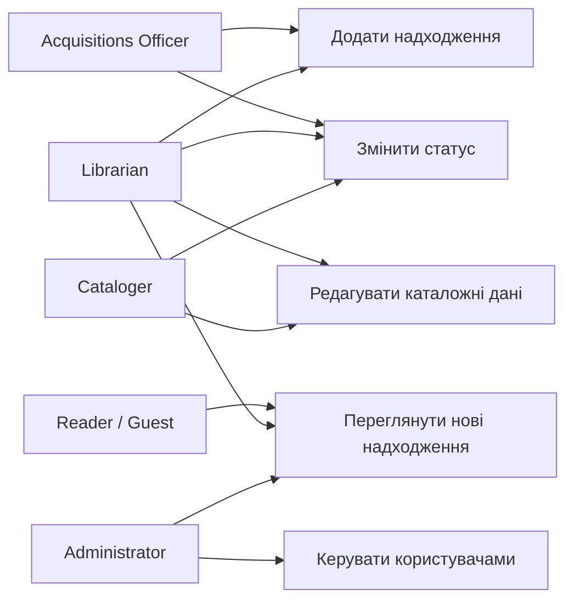

# Use case діаграма

Проста діаграма прецедентів для системи обліку нових надходжень.

## Діаграма

## Короткий опис

- **Acquisitions Officer** фіксує закупівлі та дари, ставить початковий статус.
- **Librarian** працює з записами ширше: додає, міняє статуси, може правити дані.
- **Cataloger** зосереджений на каталожних полях і готовності до видачі.
- **Reader / Guest** лише дивиться публічний список новинок.
- **Administrator** налаштовує користувачів і ролі, також може переглядати список.

Зв’язки на діаграмі показують, хто з ким працює на рівні основних сценаріїв першої версії. Деталі екранів і полів — у файлах вимог і user stories.
